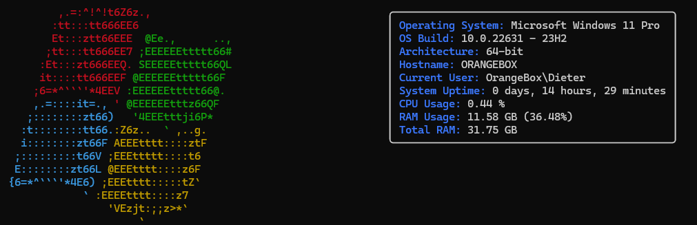
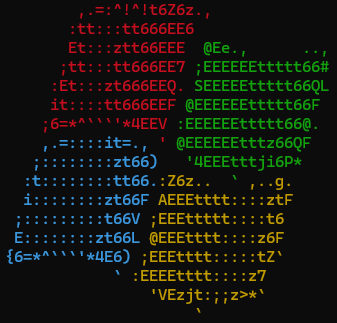
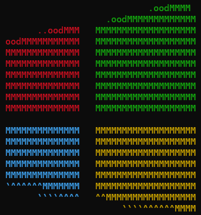
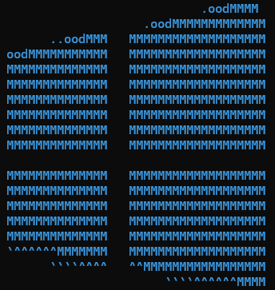
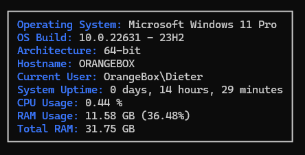
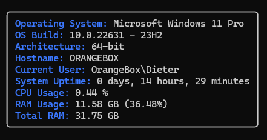
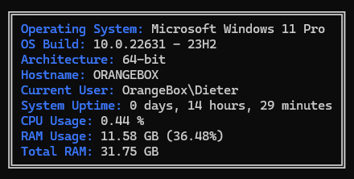
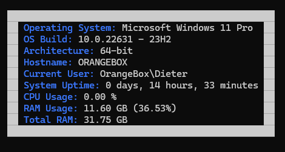
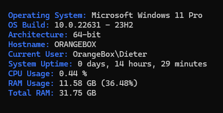

# PoSHFetch
PoSHFetch is a command-line system information tool written in `PowerShell 5.1`. PoSHFetch displays information about your operating system, software and hardware in an aesthetic and visually pleasing way. PoSHFetch is easily customizable and has build in options.

The Default layout looks like this:


## Features

- Displays key system information such as OS version, CPU and RAM usage.
- Customizable output with various border styles like rounded, double-lined, and bold.
- Colored and non-colored output options.

## Prerequisites

Before you run this script, ensure you have the following:
- Windows PowerShell 5.1 or higher.

## Setup
1. Clone this repository or download the source code.
2. Import the module into your PowerShell session:

```powershell
Import-Module .\path\to\PoshFetch.psm1
```

Replace `.\path\to\PoshFetch.psm1` with the actual path to the `PoshFetch.psm1` file. Add the import to your [PowerShell Profile](https://learn.microsoft.com/en-us/powershell/module/microsoft.powershell.core/about/about_profiles?view=powershell-5.1) if you want to make this available across your sessions.

## Run it

Run it with
``` PowerShell
Get-Info
```

## Customization
### Build in
Change the `Param` Block of the function to change the default behaviour:
```PowerShell
function New-Info {
    param (
        [Parameter(Mandatory = $true)]
        [object]$Logo = $WaveLogoColored,
        [Parameter(Mandatory = $true)]
        [object]$Info = $Info,
        [Parameter(Mandatory = $true)]
        [object]$Box = $RoundedBox
    )
    #Rest of the code is here
}
```
#### Logo options

This script comes with different logo options which can be configured:

- `WaveLogoColored`
- `ModernLogoColored`
- `ModernLogoBlue`

Colored Wave logo:


```PowerShell
New-Info -Logo $WaveLogoColored -Info $Info -Box $RoundedBox
```
Colored Modern logo:


```PowerShell
New-Info -Logo $ModernLogoColored -Info $Info -Box $RoundedBox
```
Modern Blue logo:


```PowerShell
New-Info -Logo $ModernLogoBlue -Info $Info -Box $RoundedBox
```
#### Box options
The script includes several predefined styles stored in variables:

- `$Box`: Standard box with sharp corners.
- `$RoundedBox`: Box with rounded corners.
- `$DoubleBox`: Box with double lines.
- `$BoldBox`: Box with bold lines.
- `$NoBox`: Output without any border.

Standard box:


```PowerShell
New-Info -Logo $WaveLogoColored -Info $Info -Box $Box
```
Box with rounded corners:


```PowerShell
New-Info -Logo $WaveLogoColored -Info $Info -Box $RoundedBox
```
Double Box:


```PowerShell
New-Info -Logo $WaveLogoColored -Info $Info -Box $DoubleBox
```
Bold Box:


```PowerShell
New-Info -Logo $WaveLogoColored -Info $Info -Box $BoldBox
```
No border:


```PowerShell
New-Info -Logo $WaveLogoColored -Info $Info -Box $NoBox
```

### Extended customization

You can customize the colors and style by editing the JSON objects associated with each logo and the info text in the script.

The Base JSON object looks like

```JSON
{
    "text": [
        ["This is an object", "3", "0"], ["This is also an object", "3", "0"], ["`n","7","0"]
    ]
}
```

- **`text`**: This is an array that holds other arrays. Each of these inner arrays represents a piece of text along with its display properties.

    - **`["This is an object", "3", "0"]`**:
        - `"This is an object"`: This is the actual text to be displayed.
        - `"3"`: This represents the foreground color code. 
        - `"0"`: This represents the background color code.
        
        Color values can be either the code or the color name. For reference, see [the Microsoft Page](https://learn.microsoft.com/en-us/windows-server/administration/windows-commands/color)

    - **`["`n", "7", "0"]`**:
        - "`n"`: This  represents a newline character in your text output, used to break lines or start a new line. It is used as an identifier when the line ends on both the logo and info.
        - `"7"` and `"0"` are again the foreground and background color codes, respectively (in case of the new-line, they are ignored).


## Contributing

Contributions to enhance the functionality or documentation of this script are welcome. Please ensure to test your changes before submitting a pull request.
